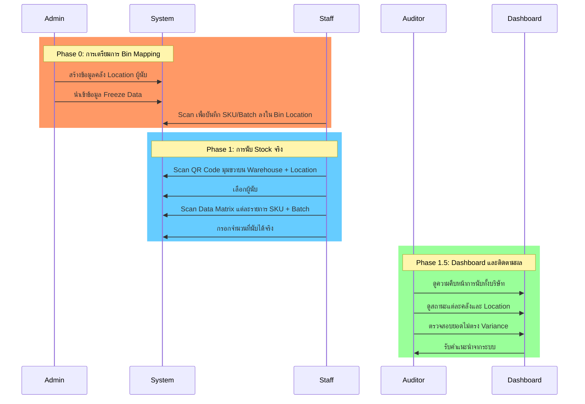
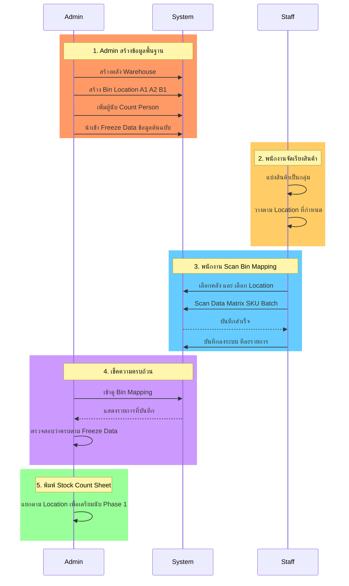
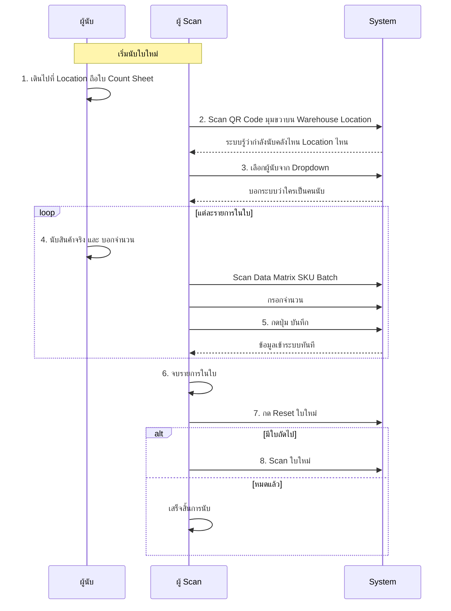
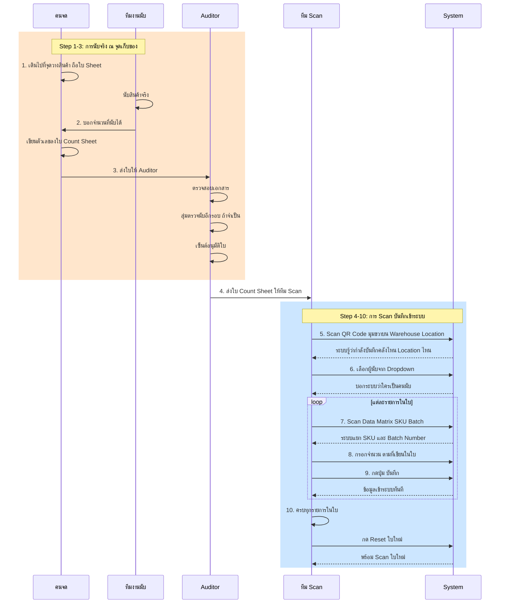

# คู่มือการใช้งานระบบนับ Stock

## 📑 สารบัญ

### 🚀 เริ่มต้นใช้งาน
- [ภาพรวมระบบ](#ภาพรวมระบบ)
- [การเข้าสู่ระบบ](#การเข้าสู่ระบบ)
- [หน้าหลัก Dashboard](#หน้าหลัก-dashboard)

### 📦 Phase 0: การเตรียมการ (สำหรับคลังที่สินค้ายังไม่อยู่กับที่)
- [1. ทำความเข้าใจกระบวนการ Bin Mapping](#1-ทำความเข้าใจกระบวนการ-bin-mapping)
- [2. เตรียมข้อมูลพื้นฐาน (Admin)](#2-เตรียมข้อมูลพื้นฐาน-admin)
  - [2.1 สร้างคลังสินค้า](#21-สร้างคลังสินค้า)
  - [2.2 สร้าง Bin Location](#22-สร้าง-bin-location)
  - [2.3 เพิ่มผู้นับ Stock](#23-เพิ่มผู้นับ-stock)
  - [2.4 นำเข้าข้อมูล Freeze Data](#24-นำเข้าข้อมูล-freeze-data)
- [3. Scan Bin Mapping (พนักงาน)](#3-scan-bin-mapping-พนักงาน)
  - [3.1 เตรียมอุปกรณ์](#31-เตรียมอุปกรณ์)
  - [3.2 ขั้นตอนการ Scan](#32-ขั้นตอนการ-scan)
  - [3.3 การแก้ไขปัญหา](#33-การแก้ไขปัญหา)

### 📊 Phase 1: การนับ Stock จริง
- [4. เตรียมการก่อนนับ](#4-เตรียมการก่อนนับ)
- [5. Scan Count - นับ Stock](#5-scan-count---นับ-stock)
  - [5.1 เตรียมอุปกรณ์](#51-เตรียมอุปกรณ์)
  - [5.2 ขั้นตอนการนับ](#52-ขั้นตอนการนับ)
  - [5.3 การแก้ไขข้อมูล](#53-การแก้ไขข้อมูล)
  - [5.4 เคล็ดลับการนับอย่างมีประสิทธิภาพ](#54-เคล็ดลับการนับอย่างมีประสิทธิภาพ)

### 📈 Phase 1.5: Dashboard และการติดตามผล
- [6. Dashboard สำหรับผู้บริหาร](#6-dashboard-สำหรับผู้บริหาร)
  - [6.1 ภาพรวมทั้งบริษัท](#61-ภาพรวมทั้งบริษัท)
  - [6.2 ดูรายละเอียดแต่ละคลัง](#62-ดูรายละเอียดแต่ละคลัง)
  - [6.3 การตรวจสอบยอดไม่ตรง (Variance)](#63-การตรวจสอบยอดไม่ตรง-variance)

### 🔧 การจัดการระบบ (Admin)
- [7. การจัดการระบบ (Admin)](#7-การจัดการระบบ-admin)
  - [7.1 จัดการผู้ใช้งาน](#71-จัดการผู้ใช้งาน)
  - [7.2 ดูและลบ Bin Mapping](#72-ดูและลบ-bin-mapping)
  - [7.3 จัดการ Freeze Data](#73-จัดการ-freeze-data)

### ❓ FAQ และการแก้ไขปัญหา
- [8. คำถามที่พบบ่อย (FAQ)](#8-คำถามที่พบบ่อย-faq)
- [9. การแก้ไขปัญหาที่พบบ่อย](#9-การแก้ไขปัญหาที่พบบ่อย)
- [10. ติดต่อฝ่าย IT](#10-ติดต่อฝ่าย-it)

---

## ภาพรวมระบบ

ระบบนับ Stock ประจำปีนี้ออกแบบมาเพื่อให้การนับ Stock มีความแม่นยำและรวดเร็วขึ้น โดยแบ่งเป็น 3 ขั้นตอนหลัก:



**🎯 เป้าหมาย:**
- ✅ ลดเวลาในการนับ Stock
- ✅ เพิ่มความแม่นยำของข้อมูล
- ✅ ติดตามความคืบหน้าแบบ Real-time
- ✅ ตรวจจับและแก้ไขยอดไม่ตรงได้ทันท่วงที

---

## การเข้าสู่ระบบ

### ขั้นตอนการ Login

1. **เปิดเว็บเบราว์เซอร์** (แนะนำ Chrome, Edge, หรือ Firefox)
2. **เข้า URL**: `http://localhost:5173` (หรือตาม IP ที่ IT แจ้ง)
3. **กรอกข้อมูล**:
   - Username: (ตามที่ Admin สร้างให้)
   - Password: (รหัสผ่านเริ่มต้นหรือที่เปลี่ยนแล้ว)
4. **กดปุ่ม "เข้าสู่ระบบ"**

![Login Screen]
```
╔═══════════════════════════════════════╗
║   🏢 ALUMET Stock Counting System    ║
║                                       ║
║   Username: [________________]        ║
║   Password: [________________]        ║
║                                       ║
║        [ เข้าสู่ระบบ ]                ║
╚═══════════════════════════════════════╝
```

**หมายเหตุ:**
- Admin User (ครั้งแรก): `admin` / `Admin@2025`
- ระบบจะจำการ Login ไว้ 14 ชั่วโมง
- หากไม่ได้ใช้งานเกิน 14 ชั่วโมง ต้อง Login ใหม่

---

## หน้าหลัก Dashboard

หลังจาก Login สำเร็จ จะเข้าสู่หน้า **Dashboard** ที่แสดงภาพรวมการนับ Stock

**เมนูด้านซ้าย:**
```
┌─────────────────────────┐
│  📊 Dashboard           │ ← ภาพรวมผู้บริหาร
├─────────────────────────┤
│  📦 Scan Bin Mapping    │ ← Phase 0: บันทึก SKU ลง Location
│  📝 Scan Count          │ ← Phase 1: นับ Stock จริง
├─────────────────────────┤
│  🏭 จัดการคลัง          │ ← Admin only
│  📍 จัดการ Location     │ ← Admin only
│  👥 จัดการผู้นับ         │ ← Admin only
│  📋 จัดการ Freeze Data  │ ← Admin only
│  📂 ดู Bin Mapping      │ ← Admin only
│  👤 จัดการผู้ใช้         │ ← Admin only
├─────────────────────────┤
│  🔓 ออกจากระบบ          │
└─────────────────────────┘
```

**สิทธิ์การใช้งาน:**
- **Admin**: เข้าถึงได้ทุกเมนู
- **Staff**: เข้าถึงเฉพาะ Dashboard, Scan Bin Mapping, Scan Count

---

## Phase 0: การเตรียมการ (Bin Mapping)

### 1. ทำความเข้าใจกระบวนการ Bin Mapping

**🤔 ทำไมต้อง Bin Mapping?**

สำหรับคลังที่สินค้ายังไม่มี Location คงที่ (เช่น WH_MILL, WH_PAINT) จำเป็นต้องกำหนด Location ชั่วคราวก่อนนับ Stock:

1. **จัดเรียงสินค้า** → แยกเป็นกลุ่มตาม Bin Location (A1, A2, B1, ...)
2. **ติด Sticker QR/Data Matrix** ที่สินค้าแต่ละชิ้น (ถ้ายังไม่มี)
3. **Scan บันทึก** → เชื่อมโยง SKU + Batch Number กับ Bin Location
4. **พิมพ์ Stock Count Sheet** → แยกตาม Location เพื่อให้ผู้นับไปตามใบ

**📊 Flow การทำงาน:**



---

## 2. เตรียมข้อมูลพื้นฐาน (Admin)

### 2.1 สร้างคลังสินค้า

**📍 เมนู:** `🏭 จัดการคลัง`

**ขั้นตอน:**

1. คลิก **"🏭 จัดการคลัง"** จากเมนูด้านซ้าย
2. ด้านบนของตาราง จะมีช่อง **"เพิ่มคลังใหม่"**
3. กรอกชื่อคลัง เช่น `WH_MILL`, `WH_PAINT`, `WH_ANODIZE`
4. กดปุ่ม **"เพิ่ม"**
5. คลังใหม่จะปรากฏในตาราง

**ตัวอย่าง:**
```
เพิ่มคลังใหม่: [WH_MILL___________] [เพิ่ม]

┌────┬──────────────┬─────────────────────┬──────────────┐
│ ID │ ชื่อคลัง     │ วันที่สร้าง         │ จัดการ       │
├────┼──────────────┼─────────────────────┼──────────────┤
│ 1  │ WH_MILL      │ 21/11/2025 09:00    │ แก้ไข | ลบ  │
│ 2  │ WH_PAINT     │ 21/11/2025 09:05    │ แก้ไข | ลบ  │
└────┴──────────────┴─────────────────────┴──────────────┘
```

**⚠️ ข้อควรระวัง:**
- ชื่อคลังไม่ควรซ้ำกัน
- ใช้ชื่อที่สั้นและจดจำง่าย (เพื่อความสะดวกในการพิมพ์รายงาน)

---

### 2.2 สร้าง Bin Location

**📍 เมนู:** `📍 จัดการ Location`

**ขั้นตอน:**

1. คลิก **"📍 จัดการ Location"** จากเมนู
2. ด้านบนมีฟอร์ม **"เพิ่ม Location ใหม่"**
3. เลือก **Warehouse** จาก dropdown (เช่น WH_MILL)
4. กรอก **Bin Location** เช่น `A1`, `A2`, `B1`, `D1A-01`
5. กดปุ่ม **"เพิ่ม"**

**ตัวอย่าง:**
```
เพิ่ม Location ใหม่:
┌─────────────────────┬─────────────────────┬─────────┐
│ Warehouse [WH_MILL▼]│ Location [A1_____] │ [เพิ่ม] │
└─────────────────────┴─────────────────────┴─────────┘

Filter: [WH_MILL ▼]

┌────┬──────────┬───────────────┬─────────────────────┬──────────────┐
│ ID │ คลัง     │ Bin Location  │ วันที่สร้าง         │ จัดการ       │
├────┼──────────┼───────────────┼─────────────────────┼──────────────┤
│ 1  │ WH_MILL  │ A1            │ 21/11/2025 09:10    │ แก้ไข | ลบ  │
│ 2  │ WH_MILL  │ A2            │ 21/11/2025 09:11    │ แก้ไข | ลบ  │
│ 3  │ WH_MILL  │ B1            │ 21/11/2025 09:12    │ แก้ไข | ลบ  │
└────┴──────────┴───────────────┴─────────────────────┴──────────────┘
```

**💡 เคล็ดลับ:**
- ตั้งชื่อ Location ให้สั้น กระชับ อ่านง่าย
- ใช้ระบบตัวเลข/ตัวอักษรที่สื่อความหมาย เช่น:
  - `A1`, `A2`, `A3` - แถว A
  - `B1`, `B2`, `B3` - แถว B
  - `D1A-01`, `D1A-02` - โซน D1A
- สร้างล่วงหน้าตามพื้นที่ที่มี เพื่อไม่ต้องมาสร้างทีหลัง

---

### 2.3 เพิ่มผู้นับ Stock

**📍 เมนู:** `👥 จัดการผู้นับ`

**ขั้นตอน:**

1. คลิก **"👥 จัดการผู้นับ"** จากเมนู
2. กรอก **ชื่อ-นามสกุล** ของผู้นับ
3. กดปุ่ม **"เพิ่ม"**

**ตัวอย่าง:**
```
เพิ่มผู้นับใหม่: [นาย สมชาย ใจดี________] [เพิ่ม]

┌────┬────────────────────┬─────────────────────┬──────────────┐
│ ID │ ชื่อ-นามสกุล       │ วันที่สร้าง         │ จัดการ       │
├────┼────────────────────┼─────────────────────┼──────────────┤
│ 1  │ นาย สมชาย ใจดี     │ 21/11/2025 09:20    │ แก้ไข | ลบ  │
│ 2  │ นาง สมหญิง รักดี   │ 21/11/2025 09:21    │ แก้ไข | ลบ  │
└────┴────────────────────┴─────────────────────┴──────────────┘
```

**📝 หมายเหตุ:**
- บันทึกชื่อคนที่จะไป**นับ Stock จริง** (ไม่ใช่คนที่ scan บันทึก)
- ใช้ชื่อจริงเพื่อความชัดเจนในการติดตามผล
- สามารถเพิ่มได้ตลอดเวลา ไม่จำเป็นต้องเพิ่มครบตั้งแต่เริ่มต้น

---

### 2.4 นำเข้าข้อมูล Freeze Data

**📍 เมนู:** `📋 จัดการ Freeze Data`

Freeze Data คือข้อมูล Stock ต้นฉบับก่อนการนับ ที่จะเอามาเปรียบเทียบกับยอดนับจริง

**ขั้นตอน:**

1. **เตรียมไฟล์ TSV** (Tab-Separated Values)
   - Export จากระบบเดิม หรือ Excel
   - บันทึกเป็น `.tsv` หรือ `.txt`
   - รูปแบบ: `SKU [TAB] BatchNo [TAB] Qty [TAB] Uom [TAB] UnitPrice`

**ตัวอย่างไฟล์ TSV:**
```tsv
SKU	BatchNo	Qty	Uom	UnitPrice
3012-001_AN_6063/T5_MILL	E7-01-00001	100.50	KG	50.00
3012-002_AN_6063/T5_MILL	E7-01-00002	200.00	KG	50.00
3012-003_AN_6063/T5_MILL		150.00	KG	50.00
```
*(แถวที่ 3 ไม่มี Batch ปล่อยว่าง)*

2. **เข้าหน้าจัดการ Freeze Data**
   - คลิก **"📋 จัดการ Freeze Data"**

3. **เลือกคลัง**
   - เลือกคลังที่ต้องการ Import เช่น `WH_MILL`

4. **เลือกไฟล์**
   - กดปุ่ม **"เลือกไฟล์"**
   - เลือกไฟล์ `.tsv` ที่เตรียมไว้

5. **กด Import**
   - ระบบจะแสดงสรุปผล:
     - ✅ นำเข้าสำเร็จ X รายการ
     - 🗑️ ลบข้อมูลเก่า Y รายการ (ถ้ามี)

6. **ตรวจสอบข้อมูล**
   - ดูในตารางด้านล่างว่าข้อมูลถูกต้องหรือไม่

**ตัวอย่างหน้าจอ:**
```
เลือกคลัง: [WH_MILL ▼]

นำเข้าไฟล์ TSV (Tab-Separated Values)
[โหลดข้อมูล] [เลือกไฟล์: freeze_wh_mill.tsv] [ลบทั้งหมด]
รูปแบบ: SKU [TAB] BatchNo [TAB] Qty [TAB] Uom [TAB] UnitPrice

✅ นำเข้าสำเร็จ 150 รายการ | 🗑️ ลบข้อมูลเก่า 0 รายการ

ข้อมูลคลัง: WH_MILL (150 รายการ)
┌────┬──────────────────────────┬──────────────┬─────────┬─────┬───────────┐
│ ID │ SKU                      │ Batch No     │ Qty     │ Uom │ UnitPrice │
├────┼──────────────────────────┼──────────────┼─────────┼─────┼───────────┤
│ 1  │ 3012-001_AN_6063/T5_MILL │ E7-01-00001  │ 100.50  │ KG  │ 50.00     │
│ 2  │ 3012-002_AN_6063/T5_MILL │ E7-01-00002  │ 200.00  │ KG  │ 50.00     │
└────┴──────────────────────────┴──────────────┴─────────┴─────┴───────────┘
```

**⚠️ ข้อควรระวัง:**
- **การ Import ซ้ำจะลบข้อมูลเก่าทั้งหมดของคลังนั้น**
- ตรวจสอบความถูกต้องของไฟล์ก่อน Import
- แยกไฟล์ตามคลัง (1 ไฟล์ต่อ 1 คลัง)
- Batch Number สามารถปล่อยว่างได้ (สำหรับ SKU ที่ไม่มี Batch)

**💡 เคล็ดลับ:**
- Export จาก Excel: File → Save As → Text (Tab delimited) (*.txt)
- ตรวจสอบด้วย Notepad ว่ามี Tab จริงๆ (ไม่ใช่ช่องว่าง)
- แถวแรกเป็น Header (ระบบจะข้ามไป)

---

## 3. Scan Bin Mapping (พนักงาน)

### 3.1 เตรียมอุปกรณ์

**✅ สิ่งที่ต้องเตรียม:**
1. **Barcode Scanner** (เชื่อมต่อ USB หรือ Bluetooth)
2. **คอมพิวเตอร์/แท็บเล็ต** ที่ติดตั้งเว็บเบราว์เซอร์
3. **รายการสินค้า** ที่มี Sticker ติดอยู่ (Data Matrix หรือ Barcode)
4. **พื้นที่จัดเรียง** แบ่งตาม Bin Location (A1, A2, B1, ...)

**🔧 ตั้งค่า Barcode Scanner:**
- ตั้งให้ส่งข้อมูลแบบ **Text Input** (เหมือนพิมพ์คีย์บอร์ด)
- ตั้งให้**ไม่ส่ง Enter** หลังจาก Scan (ถ้าเป็นไปได้)
- ทดสอบ Scan ที่ Notepad ดูว่าข้อมูลออกมาถูกต้องหรือไม่

**📱 ตรวจสอบความพร้อม:**
- Login เข้าระบบสำเร็จ
- เข้าหน้า **"📦 Scan Bin Mapping"**
- ตรวจสอบว่าคลังและ Location ที่ต้องการมีอยู่แล้ว

---

### 3.2 ขั้นตอนการ Scan

**📍 เมนู:** `📦 Scan Bin Mapping`

**Flow การทำงาน:**

```
1. เลือกคลัง
   ↓
2. เลือก Bin Location
   ↓
3. Scan Data Matrix/Barcode
   ↓
4. กดปุ่ม "บันทึก"
   ↓
5. ระบบแจ้ง "บันทึกสำเร็จ"
   ↓
6. Cursor กลับมาที่ช่อง Scan อัตโนมัติ
   ↓
7. Scan ชิ้นถัดไป (วนกลับไปข้อ 3)
```

**ขั้นตอนละเอียด:**

1. **เลือกคลัง** (Warehouse)
   ```
   เลือกคลัง: [WH_MILL ▼]
   ```
   - คลิก dropdown เลือกคลังที่ต้องการ

2. **เลือก Bin Location**
   ```
   เลือก Location: [A1 ▼] (มีช่องค้นหา)
   ```
   - คลิก dropdown
   - พิมพ์ค้นหา หรือเลื่อนเลือก
   - เช่น พิมพ์ `A1` จะหา Location ที่มี A1

3. **Scan Data Matrix/Barcode**
   ```
   Scan Label: [|3012-001_AN_6063/T5_MILL|E7-01-00001|___]
   ```
   - **Focus ที่ช่อง "Scan Label"** (ควรมี cursor กระพริบ)
   - **Scan sticker** ที่ติดอยู่บนสินค้า
   - รูปแบบที่ถูกต้อง: `|SKU|BatchNumber|`
   - ระบบจะแสดง SKU และ Batch Number ที่แยกแล้วด้านล่าง

4. **กดปุ่ม "บันทึก"**
   ```
   SKU: 3012-001_AN_6063/T5_MILL
   Batch: E7-01-00001
   
   [บันทึก]
   ```
   - ตรวจสอบข้อมูลว่าถูกต้อง
   - กดปุ่ม **"บันทึก"**
   - ระบบจะแสดง: ✅ **"บันทึกสำเร็จ!"**
   - ช่อง Scan จะ**เคลียร์อัตโนมัติ**และ**พร้อม Scan ต่อ**

5. **Scan ชิ้นถัดไป**
   - Cursor จะกลับมาที่ช่อง Scan อัตโนมัติ
   - เอาสินค้าชิ้นถัดไปมา Scan เลย
   - ไม่ต้องคลิกหรือกด Tab

**ตัวอย่างหน้าจอ:**
```
╔═══════════════════════════════════════════════════════════╗
║  📦 Scan Bin Mapping                                      ║
╠═══════════════════════════════════════════════════════════╣
║  1. เลือกคลัง                                             ║
║  ┌────────────────────────────────────────────────────┐   ║
║  │ [WH_MILL                               ▼]         │   ║
║  └────────────────────────────────────────────────────┘   ║
║                                                            ║
║  2. เลือก Bin Location                                    ║
║  ┌────────────────────────────────────────────────────┐   ║
║  │ [A1                                    ▼] 🔍      │   ║
║  └────────────────────────────────────────────────────┘   ║
║                                                            ║
║  3. Scan Label (รูปแบบ: |SKU|Batch|)                     ║
║  ┌────────────────────────────────────────────────────┐   ║
║  │ |3012-001_AN_6063/T5_MILL|E7-01-00001|_           │   ║
║  └────────────────────────────────────────────────────┘   ║
║                                                            ║
║  ✓ SKU: 3012-001_AN_6063/T5_MILL                          ║
║  ✓ Batch No: E7-01-00001                                  ║
║                                                            ║
║                        [บันทึก]                           ║
║                                                            ║
║  ✅ บันทึกสำเร็จ!                                         ║
╚═══════════════════════════════════════════════════════════╝
```

**🎯 เคล็ดลับเพิ่มความเร็ว:**
- **ไม่ต้องกด Enter** หลัง Scan (ให้กดปุ่ม "บันทึก" แทน)
- **เตรียมสินค้าเรียงแถว** ตาม Location เพื่อ Scan ต่อเนื่อง
- **เปลี่ยน Location** เฉพาะเมื่อจะเริ่ม Location ใหม่
- **Scan ต่อเนื่อง** โดยไม่ต้องคลิกเมาส์ (Focus อัตโนมัติ)

---

### 3.3 การแก้ไขปัญหา

#### ❌ Error: "ตรวจสอบ sticker หรือภาษาของ keyboard"

**สาเหตุ:** Scan ออกมาไม่ขึ้นต้นด้วย `|`

**วิธีแก้:**
1. **เช็ค Keyboard ภาษา**: 
   - ต้องเป็น **English (US)** 
   - ถ้าเป็นภาษาไทย `|` จะกลายเป็น `ฃ`
   - กด `Alt+Shift` หรือคลิกขวาล่าง เปลี่ยนเป็น EN

2. **ลอง Scan ที่ Notepad**:
   - เปิด Notepad
   - Scan ดูว่าได้อะไร
   - ถ้าไม่ขึ้นต้นด้วย `|` = Sticker ผิด หรือ Scanner ตั้งค่าผิด

3. **ตรวจ Sticker**:
   - Sticker ต้องเป็นรูปแบบ: `|SKU|Batch|`
   - ถ้าไม่มี `|` = พิมพ์ผิดหรือรูปแบบไม่ถูก

---

#### ❌ Error: "SKU และ Batch Number นี้ถูกบันทึกไว้แล้ว"

**สาเหตุ:** SKU + Batch ซ้ำใน Location เดียวกัน

**วิธีแก้:**
1. **Scan ผิดชิ้น** = เอาชิ้นที่ถูกมา Scan แทน
2. **Scan ซ้ำ** = ข้ามไปชิ้นถัดไป
3. **จริงๆ ซ้ำ** = แจ้ง Admin เพื่อลบรายการเก่า (ดูที่เมนู "📂 ดู Bin Mapping")

---

#### ❌ Scanner ไม่ทำงาน

**วิธีแก้:**
1. **เช็คสาย USB/Bluetooth**: เสียบใหม่ หรือเชื่อมต่อใหม่
2. **ลอง Scan ที่ Notepad**: ถ้าได้ = ปัญหาอยู่ที่หน้าเว็บ
3. **รีเฟรชหน้าเว็บ**: กด F5
4. **Restart Scanner**: ปิด-เปิดใหม่

---

#### ❌ ช่อง Scan ไม่มี Cursor

**วิธีแก้:**
1. **คลิกที่ช่อง Scan**: ให้มี cursor กระพริบ
2. **กด Tab**: เพื่อ Focus ไปที่ช่อง Scan
3. **กด F5**: รีเฟรชหน้าเว็บ

---

### ✅ เช็คความครบถ้วน (Admin)

หลังจาก Scan เสร็จ Admin ควรเช็คว่าครบหรือยัง:

1. **เข้าเมนู "📂 ดู Bin Mapping"**
2. **Filter ตามคลัง** และ **Location**
3. **ดูจำนวนรายการ** ว่าตรงกับ Freeze Data หรือไม่
4. **ถ้าขาด** → แจ้งพนักงาน Scan เพิ่ม
5. **ถ้าซ้ำ/ผิด** → ลบแล้ว Scan ใหม่

---

## Phase 1: การนับ Stock จริง

### 4. เตรียมการก่อนนับ

**✅ สิ่งที่ต้องเตรียม:**

1. **✅ ข้อมูลพื้นฐานครบ** (จาก Phase 0):
   - มีคลังและ Location ในระบบแล้ว
   - Import Freeze Data แล้ว
   - มีรายชื่อผู้นับในระบบแล้ว
   - (ถ้าคลังต้อง Bin Mapping: ทำ Mapping เสร็จแล้ว)

2. **📄 พิมพ์ Stock Count Sheet**:
   - พิมพ์จาก Freeze Data (Export Excel)
   - แยกตาม Warehouse และ Location
   - มี QR Code มุมขวาบน สำหรับ Scan (รูปแบบ: `|Warehouse|Location|`)
   - มี Data Matrix แต่ละรายการ (รูปแบบ: `|SKU|Batch|`)

3. **🔧 อุปกรณ์**:
   - Barcode Scanner (USB/Bluetooth)
   - คอมพิวเตอร์/แท็บเล็ต + เว็บเบราว์เซอร์
   - Stock Count Sheet (ใบที่พิมพ์มา)

4. **👥 บุคลากร**:
   - **ผู้นับ** (Count Person): คนที่ไปนับ Stock จริง ณ จุดเก็บของ
   - **ผู้ Scan** (Scan Person): คนที่นั่งบันทึกข้อมูลเข้าระบบ (Login อยู่)

**📊 Flow การทำงาน Phase 1:**



**💡 Tips:**
- **1 ใบ = 1 Location**: แต่ละใบจะครอบคลุม 1 Location เท่านั้น
- **แก้ไขได้ทันที**: ถ้านับผิด สามารถแก้ไขจำนวนได้ทันทีหน้าจอ
- **ไม่ต้องรออินเทอร์เน็ต**: ข้อมูลบันทึกทันทีที่กดปุ่ม (ไม่ต้องรอ sync)

---

## 5. Scan Count - นับ Stock

### 5.1 เตรียมอุปกรณ์

**✅ ตรวจสอบความพร้อม:**
1. ✅ Scanner เชื่อมต่อเรียบร้อย (ลอง Scan ที่ Notepad)
2. ✅ Login เข้าระบบแล้ว
3. ✅ เข้าหน้า **"📝 Scan Count"**
4. ✅ มีใบ Stock Count Sheet พร้อมแล้ว
5. ✅ Keyboard เป็น **English (EN)** (ไม่ใช่ไทย)

---

### 5.2 ขั้นตอนการนับ

**📊 ภาพรวมกระบวนการนับ Stock:**



**👥 บทบาทหน้าที่:**
- **ทีมงานนับ**: นับสินค้าจริง ณ จุดเก็บของ
- **คนจด**: เขียนจำนวนลงใบ Count Sheet
- **Auditor**: ตรวจสอบความถูกต้อง + สุ่มตรวจ + เซ็นต์อนุมัติ
- **ทีม Scan**: Scan บันทึกข้อมูลเข้าระบบ
- **ผู้ Login** (Scan Person): บันทึกโดยใคร (เก็บไว้ใน Database)

**💡 หมายเหตุ:**
- ใบ Count Sheet = เอกสารกระดาษที่มี QR Code + รายการสินค้า + ช่องกรอกจำนวน
- การนับจริงเกิดขึ้น "ณ จุดเก็บของ" ไม่ใช่หน้าคอมพิวเตอร์
- ระบบคอมพิวเตอร์ใช้สำหรับ "บันทึกข้อมูล" หลังจากนับและตรวจสอบเสร็จแล้ว

---

**📍 เมนู:** `📝 Scan Count`

#### **ขั้นตอนที่ 5 (ในระบบ): Scan Warehouse & Location**

```
╔═══════════════════════════════════════════════════════════╗
║  📝 Scan ใบนับ Stock               [Reset ใบใหม่]        ║
╠═══════════════════════════════════════════════════════════╣
║  1. Scan Warehouse & Location (มุมขวาบน)                ║
║  ┌────────────────────────────────────────────────────┐  ║
║  │ Scan รหัส QR มุมขวาบน                              │  ║
║  │ [|WH_MILL|D1B-02|___________________________]      │  ║
║  │ รูปแบบ: |Warehouse|Location|                       │  ║
║  └────────────────────────────────────────────────────┘  ║
║               [ยืนยันคลัง]                               ║
╚═══════════════════════════════════════════════════════════╝
```

1. **ดูที่มุมขวาบนของใบ Stock Count Sheet**
2. **Scan QR Code** ที่มุมขวาบน
   - รูปแบบ: `|WH_MILL|D1B-02|`
   - ส่วนแรก = Warehouse
   - ส่วนที่สอง = Location (ถ้าไม่มี Location ปล่อยว่าง `|WH_MILL||`)
3. **กดปุ่ม "ยืนยันคลัง"**
4. ระบบจะแสดง: ✅ **"คลัง: WH_MILL - Location: D1B-02"**

**⚠️ ข้อควรระวัง:**
- ถ้า Scan ผิด ให้ Scan ใหม่ (ข้อมูลเก่าจะถูกแทนที่)
- Location สามารถเป็น `null` ได้ (สำหรับคลังที่ไม่มี Location)

**💡 Tips:**
- QR Code อยู่มุมขวาบนของใบ Count Sheet
- Scan ครั้งเดียวต่อ 1 ใบ (ตอนเริ่มต้นใบ)

---

#### **ขั้นตอนที่ 6 (ในระบบ): เลือกผู้นับ**

```
╠═══════════════════════════════════════════════════════════╣
║  ✓ คลัง: WH_MILL - Location: D1B-02                     ║
╠═══════════════════════════════════════════════════════════╣
║  2. เลือกผู้นับ                                          ║
║  ┌────────────────────────────────────────────────────┐  ║
║  │ [นาย สมชาย ใจดี                    ▼] 🔍         │  ║
║  └────────────────────────────────────────────────────┘  ║
╚═══════════════════════════════════════════════════════════╝
```

1. **คลิก Dropdown "เลือกผู้นับ"**
2. **พิมพ์ค้นหา** หรือเลื่อนเลือกชื่อผู้นับ
3. **คลิกเลือก** ชื่อที่ต้องการ

**💡 หมายเหตุ:**
- ผู้นับ = คนที่ไปนับ Stock จริง ณ จุดเก็บของ (ไม่ใช่คนที่ Scan)
- เลือกครั้งเดียวต่อ 1 ใบ
- ถ้านับคนละคน ต้อง Reset ใบใหม่
- ชื่อผู้นับจะถูกบันทึกไว้ทุกรายการ (สำหรับ Audit Trail)

---

#### **ขั้นตอนที่ 7-9 (ในระบบ): Scan SKU → กรอกจำนวน → บันทึก**

```
╠═══════════════════════════════════════════════════════════╣
║  ✓ ผู้นับ: นาย สมชาย ใจดี                                ║
╠═══════════════════════════════════════════════════════════╣
║  3. Scan SKU & กรอกจำนวน                                 ║
║  ┌──────────────────────┬───────────────┬──────────────┐ ║
║  │ Scan SKU             │ SKU           │ Batch No     │ ║
║  │ [Scan |SKU|Batch|__] │ 3012-001...   │ E7-01-00001  │ ║
║  └──────────────────────┴───────────────┴──────────────┘ ║
║               [Scan]                                      ║
║                                                           ║
║  ┌───────────────────────────┐  ┌──────────────┐        ║
║  │ จำนวน: [100.50__________]│  │  [บันทึก]    │        ║
║  └───────────────────────────┘  └──────────────┘        ║
║                                                           ║
║  ✅ บันทึกสำเร็จ! SKU: 3012-001... | Batch: E7-... | จำนวน: 100.50
╚═══════════════════════════════════════════════════════════╝
```

**Loop สำหรับแต่ละรายการในใบ Count Sheet:**

**7.1 Scan Data Matrix**
- Scan **Data Matrix จากใบ Count Sheet** (หรือจาก Sticker บนสินค้า ถ้ามี)
- รูปแบบ: `|3012-001_AN_6063/T5_MILL|E7-01-00001|`
- ระบบจะแยก SKU และ Batch Number อัตโนมัติ

**7.2 กดปุ่ม "Scan"**
- ระบบจะตรวจสอบ:
  - ✅ รูปแบบถูกต้องหรือไม่ (ต้องขึ้นต้นด้วย `|`)
  - ✅ ซ้ำหรือไม่ (SKU + Batch ใน Location นี้)
- **ถ้าผ่าน** → Cursor จะกระโดดไปช่องจำนวนอัตโนมัติ
- **ถ้าผิด** → แสดง error + Cursor อยู่ที่ช่อง Scan เดิม

**8. กรอกจำนวน**
- **พิมพ์ตัวเลขตามที่คนจดเขียนไว้ในใบ Count Sheet**
- รองรับทศนิยม เช่น `100.50`, `200`, `15.75`
- **ไม่ต้องกด Enter** (ป้องกันการ submit โดยไม่ตั้งใจ)

💡 **สำคัญ:** ตัวเลขที่กรอกต้องตรงกับที่คนจดเขียนในใบ Count Sheet (หลังจาก Auditor ตรวจเซ็นต์แล้ว)

**9. กดปุ่ม "บันทึก"**
- ระบบจะ:
  - ✅ บันทึกข้อมูลเข้า Database พร้อมบันทึก:
    - SKU, Batch Number, จำนวน
    - ชื่อผู้นับ (Count Person)
    - ชื่อผู้ Scan (Login อยู่)
    - วันเวลาที่บันทึก
  - ✅ แสดงข้อความ "บันทึกสำเร็จ!" (สีเขียว, แสดง 1.5 วินาที)
  - ✅ เคลียร์ช่อง SKU/Batch/จำนวน
  - ✅ **Cursor กลับไปที่ช่อง Scan SKU อัตโนมัติ**
  - ✅ รีเฟรชตารางด้านล่าง (แสดงรายการที่บันทึกแล้ว)

**10. Scan รายการถัดไป**
- วนกลับไปข้อ 7.1 (Scan Data Matrix รายการถัดไป)
- ไม่ต้องคลิกหรือกด Tab (Cursor พร้อมอยู่แล้ว)
- ทำต่อเนื่องจนครบทุกรายการในใบ Count Sheet

---

#### **ดูรายการที่บันทึกแล้ว (Real-time)**

```
╠═══════════════════════════════════════════════════════════╣
║  รายการที่นับแล้ว: WH_MILL - D1B-02 (5 รายการ)          ║
║  ┌───┬──────────────┬──────────┬──────┬────────┬─────────┐
║  │ # │ SKU          │ Batch    │ Qty  │ ผู้นับ │ จัดการ │
║  ├───┼──────────────┼──────────┼──────┼────────┼─────────┤
║  │ 1 │ 3012-001_AN..│ E7-01... │ 100  │ สมชาย  │ แก้ไข ลบ│
║  │ 2 │ 3012-002_AN..│ E7-01... │ 200  │ สมชาย  │ แก้ไข ลบ│
║  │ 3 │ 3012-003_AN..│ E7-02... │ 150  │ สมชาย  │ แก้ไข ลบ│
║  └───┴──────────────┴──────────┴──────┴────────┴─────────┘
╚═══════════════════════════════════════════════════════════╝
```

- ตารางจะแสดงรายการที่บันทึกแล้ว **แบบ Real-time**
- แสดงข้อมูล:
  - **SKU**: รหัสสินค้า
  - **Batch**: Batch Number (ถ้ามี)
  - **Qty**: จำนวนที่บันทึก (ตามที่เขียนในใบ Count Sheet)
  - **ผู้นับ**: ชื่อผู้นับ (คนที่นับจริง ณ จุดเก็บของ)
  - **ผู้ Scan**: ชื่อผู้ที่บันทึก (Login อยู่, อยู่ใน tooltip)
  - **วันที่**: วันเวลาที่บันทึก

**💡 Use Case:**
- **ตรวจสอบความครบถ้วน**: เทียบจำนวนรายการในตารางกับรายการในใบ Count Sheet
- **เช็คความถูกต้อง**: ดูว่า SKU, Batch, จำนวนตรงกับที่เขียนในใบหรือไม่
- **แก้ไขทันที**: ถ้าพบผิดพลาด สามารถแก้ไขหรือลบได้ทันที

---

#### **จบใบ - Reset ใบใหม่**

เมื่อบันทึกครบทุกรายการในใบ Count Sheet:

**✅ Checklist ก่อนจบใบ:**
- [ ] บันทึกครบทุกรายการในใบ Count Sheet แล้ว
- [ ] จำนวนรายการในตารางตรงกับจำนวนรายการในใบ
- [ ] ตัวเลขในระบบตรงกับตัวเลขที่เขียนในใบ
- [ ] ไม่มีรายการซ้ำ
- [ ] Auditor เซ็นต์อนุมัติใบนี้แล้ว

**กดปุ่ม "Reset ใบใหม่":**
1. กดปุ่ม **"Reset ใบใหม่"** (มุมขวาบน)
2. ระบบจะ:
   - ❌ เคลียร์ข้อมูล Warehouse/Location
   - ❌ เคลียร์ผู้นับ
   - ❌ เคลียร์ตาราง
   - ✅ พร้อม Scan ใบใหม่
3. **เอาใบ Count Sheet ใบถัดไปมา**
4. กลับไปขั้นตอนที่ 5 (Scan QR Code มุมขวาบนของใบใหม่)

---

### 5.3 การแก้ไขข้อมูล

#### **แก้ไขจำนวน (Inline Editing)**

ถ้านับผิด สามารถแก้ไขได้ทันที:

```
┌───┬──────────────┬──────────┬──────┬────────┬─────────┐
│ 2 │ 3012-002_AN..│ E7-01... │ 200  │ สมชาย  │ แก้ไข ลบ│
└───┴──────────────┴──────────┴──────┴────────┴─────────┘
                               ↓ คลิก "แก้ไข"
┌───────────────────────────────────────────────────────┐
│ แก้ไขจำนวน                                   [X ปิด] │
├───────────────────────────────────────────────────────┤
│ SKU: 3012-002_AN_6063/T5_MILL                         │
│ Batch: E7-01-00002                                    │
│                                                       │
│ จำนวนเดิม: 200.00                                    │
│ จำนวนใหม่: [205.50___________]                       │
│                                                       │
│                 [บันทึก] [ยกเลิก]                     │
└───────────────────────────────────────────────────────┘
```

**ขั้นตอน:**
1. คลิกปุ่ม **"แก้ไข"** ในแถวที่ต้องการ
2. กรอก**จำนวนใหม่**
3. กดปุ่ม **"บันทึก"**
4. ระบบจะ:
   - ✅ อัพเดทจำนวนในฐานข้อมูล
   - ✅ บันทึก **Audit Trail** (วันเวลาที่แก้ไข + ชื่อผู้แก้ไข)
   - ✅ รีเฟรชตารางทันที

**💡 หมายเหตุ:**
- สามารถแก้ไขได้**หลายครั้ง**
- ระบบจะเก็บ **ประวัติการแก้ไข** (updatedAt, updatedBy)
- แสดง "(แก้ไขแล้ว)" ในตาราง

---

#### **ลบรายการ**

ถ้า Scan ผิดชิ้น หรือต้องการลบ:

```
┌───────────────────────────────────────────────────────┐
│ ⚠️ ยืนยันการลบ                              [X ปิด] │
├───────────────────────────────────────────────────────┤
│ คุณแน่ใจหรือไม่ว่าต้องการลบรายการนี้?               │
│                                                       │
│ SKU: 3012-003_AN_6063/T5_MILL                         │
│ Batch: E7-02-00001                                    │
│ จำนวน: 150.00                                        │
│                                                       │
│         [ยืนยันลบ] [ยกเลิก]                           │
└───────────────────────────────────────────────────────┘
```

**ขั้นตอน:**
1. คลิกปุ่ม **"ลบ"** ในแถวที่ต้องการ
2. อ่านข้อความยืนยัน
3. กดปุ่ม **"ยืนยันลบ"**
4. รายการจะถูกลบออกจาก Database และตาราง

**⚠️ ข้อควรระวัง:**
- **ลบแล้วกู้คืนไม่ได้**
- ใช้เฉพาะกรณีที่ Scan ผิดจริงๆ
- ถ้าแค่จำนวนผิด ให้ใช้ "แก้ไข" แทน

---

### 5.4 เคล็ดลับการนับอย่างมีประสิทธิภาพ

#### **🚀 เพิ่มความเร็ว:**

1. **เตรียมสินค้าให้พร้อม**
   - เรียงสินค้าให้เห็น Sticker ชัดเจน
   - จัดกลุ่มตาม SKU (ถ้าเป็นไปได้)

2. **ใช้ปุ่มแทนการกด Enter**
   - กด "Scan" หลัง Scan SKU
   - กด "บันทึก" หลังกรอกจำนวน
   - ป้องกันการ submit โดยไม่ตั้งใจ

3. **ใช้ Keyboard Shortcut**
   - `Tab` = ย้าย Cursor ไปช่องถัดไป
   - `Shift+Tab` = ย้าย Cursor กลับ
   - `Alt+S` = กดปุ่ม "Scan" (ถ้ารองรับ)

4. **Focus ตามลำดับ**
   - Error → Focus กลับช่องที่ error (แก้ไขได้ทันที)
   - Success → Focus ไปช่องถัดไป (ทำงานต่อเลย)

---

#### **✅ ป้องกันความผิดพลาด:**

1. **เช็ค Keyboard ภาษา**
   - ต้องเป็น **EN** ตลอดเวลา
   - ถ้าเป็นภาษาไทย `|` จะกลายเป็น `ฃ`

2. **เช็ค Location ก่อน Scan**
   - ดูว่าแสดง "คลัง: XXX - Location: YYY" ถูกต้องหรือไม่
   - ถ้าผิด → Scan QR Code ใหม่

3. **เช็คผู้นับก่อน Scan**
   - ต้องเลือกผู้นับก่อนถึงจะ Scan SKU ได้
   - ถ้าลืมเลือก → ระบบจะแจ้งเตือน

4. **เช็คจำนวนก่อนกด "บันทึก"**
   - ดูว่ากรอกถูกหรือไม่
   - รองรับทศนิยม (100.50, 15.75)

5. **ตรวจตารางด้านล่าง**
   - เช็คว่ารายการที่นับมาครบหรือยัง
   - เทียบกับใบ Stock Count Sheet

---

#### **🔄 State Persistence (กลับมา Scan ซ้ำ):**

ถ้าพนักงานนับเจอของเพิ่ม ต้องกลับมานับที่ Location เดิม:

1. **Scan QR Code เดิมอีกครั้ง**
2. **เลือกผู้นับเดิม**
3. ระบบจะ**โหลดรายการที่เคยแสกนมาแสดงอัตโนมัติ**
4. **เพิ่มรายการใหม่ได้เลย** (ไม่ต้องเริ่มใหม่)

**Use Case:**
```
09:00 - นับ Location A1 เสร็จ (20 รายการ)
09:30 - ไปนับ Location A2
10:00 - เจอของตกหล่นใน Location A1 (อีก 2 รายการ)
10:05 - Scan QR Code A1 อีกครั้ง
       → ระบบโหลด 20 รายการเดิมมา
       → เพิ่มอีก 2 รายการ
       → รวม 22 รายการ
```

---

#### **📋 Checklist ก่อนจบใบ:**

- [ ] นับครบทุกรายการในใบแล้ว
- [ ] เทียบจำนวนรายการกับ Freeze Data (ถ้ามี)
- [ ] เช็คตารางว่าไม่มีรายการซ้ำ
- [ ] เช็คจำนวนว่าสมเหตุสมผล (ไม่มีเลขประหลาด)
- [ ] แก้ไขข้อมูลที่ผิดแล้ว (ถ้ามี)
- [ ] กด "Reset ใบใหม่" เพื่อเริ่มใบถัดไป

---

### การแก้ไขปัญหาระหว่างนับ

#### ❌ Error: "SKU 'xxx' Batch 'xxx' มีในระบบแล้ว (ID: xxx)"

**สาเหตุ:** Scan ซ้ำ (SKU + Batch เดียวกันใน Location เดียวกัน)

**วิธีแก้:**
1. **Scan ผิดชิ้น** → Scan ชิ้นที่ถูกแทน
2. **จริงๆ ซ้ำ** → ข้ามไป (ไม่ต้องบันทึก)
3. **ต้องการแก้จำนวน** → ใช้ "แก้ไข" ในตาราง แทนการ Scan ใหม่

---

#### ❌ Error: "กรุณาเลือกผู้นับก่อน"

**สาเหตุ:** ยังไม่ได้เลือกผู้นับ

**วิธีแก้:**
1. เลื่อนขึ้นไปด้านบน
2. คลิก dropdown "เลือกผู้นับ"
3. เลือกชื่อผู้นับ
4. กลับมา Scan SKU ต่อ

---

#### ❌ Cursor ไม่อยู่ที่ช่องที่ต้องการ

**วิธีแก้:**
1. **คลิกที่ช่อง** ที่ต้องการ
2. หรือกด **Tab/Shift+Tab** เพื่อย้าย Cursor
3. หรือกด **F5** รีเฟรชหน้าเว็บ

---

#### ❌ ตารางไม่โหลด / ไม่แสดงรายการ

**วิธีแก้:**
1. **รีเฟรชหน้าเว็บ**: กด F5
2. **เช็คการเชื่อมต่อ**: ดูว่าออนไลน์อยู่หรือไม่
3. **Login ใหม่**: ออกจากระบบ แล้ว Login เข้าใหม่

---

#### ❌ กด "บันทึก" แล้วไม่มีอะไรเกิดขึ้น

**สาเหตุ:** อาจจะ:
- ช่องจำนวนว่างเปล่า
- จำนวนเป็น 0 หรือติดลบ
- ยังไม่ได้ Scan SKU
- Network ขาด

**วิธีแก้:**
1. **เช็คว่ากรอกจำนวนแล้วหรือยัง**
2. **เช็คว่าจำนวน > 0**
3. **เช็ค Network**: ลองเปิดเว็บอื่นดู
4. **ดู Console Error** (กด F12): มี error อะไรหรือไม่

---

## Phase 1.5: Dashboard และการติดตามผล

### 6. Dashboard สำหรับผู้บริหาร

**📍 เมนู:** `📊 Dashboard`

Dashboard เป็นหน้าสำหรับผู้บริหาร, ผู้จัดการ, และ Auditor ในการติดตามความคืบหน้าการนับ Stock แบบ Real-time พร้อมวิเคราะห์ความแม่นยำและตรวจจับยอดไม่ตรง

**🎯 วัตถุประสงค์:**
- ติดตามความคืบหน้าการนับทั้งบริษัท
- ดูสถานะแต่ละคลังและ Location
- ตรวจสอบยอดไม่ตรง (Variance)
- รับคำแนะนำจากระบบ

---

### 6.1 ภาพรวมทั้งบริษัท

เมื่อเข้าหน้า Dashboard จะเห็นภาพรวมการนับ Stock ทั้งบริษัททันที

#### **ส่วนที่ 1: สถานะระดับรายการ**

```
╔═══════════════════════════════════════════════════════════╗
║  🏢 สถานะภาพรวมทั้งบริษัท                                 ║
╠═══════════════════════════════════════════════════════════╣
║  ┌───────────────┬───────────────┬───────────────┬───────┐
║  │ จำนวนรายการ  │ นับแล้ว       │ ความคืบหน้า  │ สถานะ │
║  │ ทั้งหมด       │               │               │       │
║  ├───────────────┼───────────────┼───────────────┼───────┤
║  │   1,500       │   1,200       │     80%       │ 🔄    │
║  │   รายการ      │   รายการ      │ ████████░░    │กำลัง │
║  │               │               │               │ดำเนิน│
║  └───────────────┴───────────────┴───────────────┴───────┘
╚═══════════════════════════════════════════════════════════╝
```

**ข้อมูลที่แสดง:**
- **จำนวนรายการทั้งหมด**: ยอดรวมจาก Freeze Data ทุกคลัง
- **นับแล้ว**: จำนวนรายการที่มีการนับเสร็จแล้ว
- **ความคืบหน้า**: % Progress พร้อม Progress Bar
  - 0-30% = สีแดง (เตือน)
  - 31-60% = สีเหลือง (ปานกลาง)
  - 61-90% = สีส้ม (ใกล้เสร็จ)
  - 91-100% = สีเขียว (เสร็จสมบูรณ์)
- **สถานะ**: 
  - "ยังไม่เริ่ม" (0%)
  - "กำลังดำเนินการ" (1-99%)
  - "เสร็จสมบูรณ์" (100%)

---

#### **ส่วนที่ 2: สถานะระดับคลังและ Location**

```
╠═══════════════════════════════════════════════════════════╣
║  📊 สถานะคลัง              📍 สถานะ Locations            ║
║  ┌─────────────────────┐   ┌─────────────────────┐       ║
║  │ คลังทั้งหมด:    5   │   │ Locations ทั้งหมด: 85 │    ║
║  │ เริ่มนับแล้ว:   4   │   │ นับแล้ว:         68 │       ║
║  │ นับครบแล้ว:    2   │   │ % ความคืบหน้า:  80% │       ║
║  │ ยังไม่เริ่ม:    1   │   │ ยังไม่นับ:       17 │       ║
║  └─────────────────────┘   └─────────────────────┘       ║
╚═══════════════════════════════════════════════════════════╝
```

**สถานะคลัง (Warehouse Summary):**
- **คลังทั้งหมด**: จำนวนคลังในระบบ
- **เริ่มนับแล้ว**: คลังที่มีรายการนับแล้วบางส่วน (countedItems > 0)
- **นับครบแล้ว**: คลังที่นับครบ 100% แล้ว
- **ยังไม่เริ่ม**: คลังที่ยังไม่มีการนับเลย

**สถานะ Locations (Location Summary):**
- **Locations ทั้งหมด**: จำนวน Location รวมทุกคลัง
- **นับแล้ว**: Location ที่มีรายการนับแล้ว
- **% ความคืบหน้า**: (นับแล้ว / ทั้งหมด) × 100
- **ยังไม่นับ**: Location ที่ยังไม่มีการนับ

**💡 Use Case:**
- ดูว่าคลังไหนนับเสร็จแล้ว คลังไหนยังค้าง
- ประเมินภาระงานที่เหลือ (กี่ Location, กี่รายการ)
- วางแผนจัดทีมงานเพิ่ม (ถ้าความคืบหน้าช้า)

---

### 6.2 ดูรายละเอียดแต่ละคลัง

ด้านล่างจะแสดง **Card แต่ละคลัง** พร้อมสถานะและปุ่มดูรายละเอียด

```
╔═══════════════════════════════════════════════════════════╗
║  📦 รายละเอียดแต่ละคลัง                                   ║
╠═══════════════════════════════════════════════════════════╣
║  ┌─────────────────────────────┐ ┌────────────────────┐  ║
║  │ 🏭 WH_MILL                  │ │ 🏭 WH_PAINT        │  ║
║  │ ─────────────────────────── │ │ ────────────────── │  ║
║  │ ความคืบหน้า: 93.75%        │ │ ความคืบหน้า: 45%  │  ║
║  │ ██████████████░             │ │ ██████░░░░░░░░░    │  ║
║  │                             │ │                    │  ║
║  │ รายการทั้งหมด:  800        │ │ รายการทั้งหมด: 400│  ║
║  │ นับแล้ว:       750          │ │ นับแล้ว:      180  │  ║
║  │ Locations:     19/20        │ │ Locations:    8/15 │  ║
║  │ ⚠️ ยอดไม่ตรง:    25         │ │ ⚠️ ยอดไม่ตรง:   5  │  ║
║  │                             │ │                    │  ║
║  │ สถานะ: กำลังนับ             │ │ สถานะ: กำลังนับ    │  ║
║  │                             │ │                    │  ║
║  │     [ดูรายละเอียด]          │ │   [ดูรายละเอียด]   │  ║
║  └─────────────────────────────┘ └────────────────────┘  ║
╚═══════════════════════════════════════════════════════════╝
```

**ข้อมูลในแต่ละ Card:**
- **ชื่อคลัง**: เช่น WH_MILL, WH_PAINT
- **% ความคืบหน้า**: Progress Bar สีเปลี่ยนตามระดับ
- **รายการทั้งหมด vs นับแล้ว**: เช่น 750/800
- **Locations**: จำนวน Location ที่นับแล้ว/ทั้งหมด
- **⚠️ ยอดไม่ตรง**: จำนวนรายการที่ Freeze Data ≠ Count Data
- **สถานะ**: 
  - "ไม่มีข้อมูลตั้งต้น" (ไม่มี Freeze Data)
  - "ยังไม่เริ่ม" (0%)
  - "กำลังนับ" (1-99%)
  - "นับครบแล้ว" (100%)
- **ปุ่มดูรายละเอียด**: คลิกเพื่อเจาะลึกระดับ Location

---

#### **Drill-Down: ดูรายละเอียดระดับ Location**

เมื่อคลิก **"ดูรายละเอียด"** จะเปิดหน้าใหม่แสดง:

**ส่วนที่ 1: สถานะแต่ละ Location**

```
╔═══════════════════════════════════════════════════════════╗
║  🏭 WH_MILL - รายละเอียดแต่ละ Location                    ║
║                                      [← กลับ]              ║
╠═══════════════════════════════════════════════════════════╣
║  📍 สถานะแต่ละ Location                                   ║
║  ┌──────────┬────────┬──────────┬─────────┬──────────────┐
║  │ Location │ ทั้งหมด│ นับแล้ว  │ ยอดไม่ตรง│ สถานะ      │
║  ├──────────┼────────┼──────────┼─────────┼──────────────┤
║  │ A1       │   50   │   50     │    3    │ ✅ นับครบ   │
║  │ ████████████████████ 100%                             │
║  ├──────────┼────────┼──────────┼─────────┼──────────────┤
║  │ A2       │   45   │   42     │    0    │ 🔄 กำลังนับ │
║  │ ██████████████░░ 93%                                  │
║  ├──────────┼────────┼──────────┼─────────┼──────────────┤
║  │ B1       │   60   │    0     │    0    │ ⏸️ ยังไม่เริ่ม│
║  │ ░░░░░░░░░░░░░░░░ 0%                                   │
║  └──────────┴────────┴──────────┴─────────┴──────────────┘
╚═══════════════════════════════════════════════════════════╝
```

**ข้อมูลแต่ละ Location:**
- **Location**: ชื่อ Bin Location (A1, A2, B1, ...)
- **ทั้งหมด**: รายการทั้งหมดจาก Freeze Data
- **นับแล้ว**: รายการที่มีการนับแล้ว
- **ยอดไม่ตรง**: รายการที่จำนวนไม่ตรงกัน
- **สถานะ**: 
  - ✅ "นับครบแล้ว" (100%)
  - 🔄 "กำลังนับ" (1-99%)
  - ⏸️ "ยังไม่เริ่ม" (0%)
- **Progress Bar**: แสดงความคืบหน้าแต่ละ Location

**💡 Use Case:**
- **จัดลำดับความสำคัญ**: เห็นว่า Location ไหนยังค้าง
- **วางแผนทีมงาน**: ส่งทีมไปนับ Location ที่ยังไม่เสร็จ
- **ตรวจสอบปัญหา**: Location ไหนมียอดไม่ตรงเยอะ

---

### 6.3 การตรวจสอบยอดไม่ตรง (Variance)

ส่วนล่างของหน้ารายละเอียดคลัง จะแสดงตาราง **รายการที่มียอดไม่ตรง**

```
╠═══════════════════════════════════════════════════════════╣
║  ⚠️ รายการที่มียอดไม่ตรง (Variance Details)              ║
║  ┌──────────────────────────────────────────────────────┐ ║
║  │ กรอง: [Location ▼] [แสดงทั้งหมด]                   │ ║
║  └──────────────────────────────────────────────────────┘ ║
║  ┌─────┬───────────┬──────────┬──────┬────────┬────────┐ ║
║  │Locat│ SKU       │ Batch    │Freeze│ Count  │ ส่วนต่าง║
║  │ion  │           │          │ Qty  │ Qty    │        │ ║
║  ├─────┼───────────┼──────────┼──────┼────────┼────────┤ ║
║  │ A1  │3012-001..│E7-01-001 │100.00│  95.50 │ -4.50  │ ║
║  │     │           │          │      │        │(-4.50%)│ ║
║  ├─────┼───────────┼──────────┼──────┼────────┼────────┤ ║
║  │ A1  │3012-002..│E7-01-002 │200.00│ 210.00 │+10.00  │ ║
║  │     │           │          │      │        │(+5.00%)│ ║
║  ├─────┼───────────┼──────────┼──────┼────────┼────────┤ ║
║  │ A2  │3012-005..│E7-02-001 │ 50.00│  45.00 │ -5.00  │ ║
║  │     │           │          │      │        │(-10.0%)│ ║
║  └─────┴───────────┴──────────┴──────┴────────┴────────┘ ║
╚═══════════════════════════════════════════════════════════╝
```

**ข้อมูลในตาราง Variance:**
- **Location**: Bin Location ที่เกิด Variance
- **SKU**: รหัสสินค้า
- **Batch**: Batch Number
- **Freeze Qty**: จำนวนจาก Freeze Data (ข้อมูลต้นฉบับ)
- **Count Qty**: จำนวนที่นับได้จริง
- **ส่วนต่าง**: 
  - จำนวน: Count - Freeze (เช่น -4.50, +10.00)
  - %: (ส่วนต่าง / Freeze) × 100
  - สีแดง = ลดลง (-)
  - สีเขียว = เพิ่มขึ้น (+)

**💡 Use Case สำหรับ Auditor:**
- **ตรวจสอบความแม่นยำ**: หา SKU ที่มีส่วนต่างมาก
- **สืบหาสาเหตุ**: 
  - นับผิด?
  - Freeze Data ผิด?
  - มีการเบิก/รับระหว่างนับ?
- **แก้ไขข้อมูล**: กลับไปนับใหม่หรือปรับ Freeze Data
- **อนุมัติผลต่าง**: บันทึกเหตุผลและอนุมัติ

**🔍 ฟีเจอร์เพิ่มเติม:**
- **Filter Location**: กรองดูเฉพาะ Location ที่สนใจ
- **Sort by Variance**: เรียงตามส่วนต่างมากสุด
- **Export Excel**: Export รายการเพื่อวิเคราะห์เพิ่มเติม (TODO)

---

### 6.4 คำแนะนำจากระบบ (Smart Recommendations)

ด้านล่างสุดของ Dashboard จะมีส่วน **💡 คำแนะนำ** ที่ระบบวิเคราะห์และแนะนำอัตโนมัติ

```
╔═══════════════════════════════════════════════════════════╗
║  💡 คำแนะนำจากระบบ                                        ║
╠═══════════════════════════════════════════════════════════╣
║  ⚠️ ความคืบหน้ารวมอยู่ที่ 45% - แนะนำเร่งการดำเนินงาน   ║
║                                                            ║
║  📋 พบ 2 คลังไม่มีข้อมูล Freeze Data - แนะนำนำเข้าข้อมูล ║
║     ก่อนเริ่มนับเพื่อความแม่นยำ                           ║
║                                                            ║
║  ⚠️ พบ 30 รายการที่มียอดไม่ตรง - แนะนำให้ Auditor         ║
║     ตรวจสอบและยืนยัน                                      ║
║                                                            ║
║  ✅ ความคืบหน้า 95% - เกือบเสร็จแล้ว! เตรียมรายงานสรุป    ║
╚═══════════════════════════════════════════════════════════╝
```

**เงื่อนไขคำแนะนำ:**

1. **ความคืบหน้าต่ำกว่า 50%**
   - 📢 "ความคืบหน้ารวมอยู่ที่ X% - แนะนำเร่งการดำเนินงาน"

2. **พบคลังไม่มี Freeze Data**
   - 📢 "พบ X คลังไม่มีข้อมูล Freeze Data - แนะนำนำเข้าข้อมูลก่อนเริ่มนับ"

3. **พบยอดไม่ตรงมาก**
   - 📢 "พบ X รายการที่มียอดไม่ตรง - แนะนำให้ Auditor ตรวจสอบและยืนยัน"

4. **ใกล้เสร็จแล้ว (≥ 90%)**
   - 📢 "ความคืบหน้า X% - เกือบเสร็จแล้ว! เตรียมรายงานสรุป"

5. **เสร็จสมบูรณ์ (100%)**
   - 📢 "🎉 นับครบแล้ว! พร้อมสรุปผลและปิดงาน"

---

### 6.5 เคล็ดลับการใช้ Dashboard

#### **สำหรับผู้บริหาร:**
- ✅ **ดูเป็นประจำ**: เปิดดูทุกเช้า-บ่ายเพื่อติดตามความคืบหน้า
- ✅ **มองภาพรวม**: ดูที่ % Progress ทั้งบริษัทและแต่ละคลัง
- ✅ **วางแผนทีมงาน**: ดูว่าคลัง/Location ไหนยังค้าง ส่งทีมเพิ่ม
- ✅ **ติดตาม Variance**: ถ้ายอดไม่ตรงเยอะ อาจต้องสอบถาม Auditor

#### **สำหรับ Auditor:**
- ✅ **Drill-Down ลึก**: คลิกดูรายละเอียดแต่ละคลัง → แต่ละ Location
- ✅ **เช็ค Variance ทุกวัน**: ดูรายการยอดไม่ตรง ตรวจสอบสาเหตุ
- ✅ **กลับไปตรวจซ้ำ**: ถ้าส่วนต่างมาก (เช่น > 10%) ให้กลับไปนับใหม่
- ✅ **บันทึกเหตุผล**: ถ้ายืนยันว่าถูกต้อง บันทึกเหตุผลไว้ (TODO: Feature)

#### **สำหรับผู้จัดการ:**
- ✅ **ดูสถานะ Location**: วางแผนว่าทีมควรไปนับ Location ไหนต่อ
- ✅ **ตรวจสอบความครบถ้วน**: เช็คว่ารายการนับครบตาม Freeze Data หรือยัง
- ✅ **สื่อสารทีมงาน**: แจ้งความคืบหน้าให้ทีมทราบ สร้าง Motivation

---

## 7. การจัดการระบบ (Admin)

### 7.1 จัดการผู้ใช้งาน

**📍 เมนู:** `👤 จัดการผู้ใช้`

Admin สามารถจัดการผู้ใช้งานระบบได้ รวมถึงสร้าง แก้ไข ลบ และรีเซ็ตรหัสผ่าน

**ฟีเจอร์:**
- ✅ ดูรายการผู้ใช้ทั้งหมด
- ✅ เพิ่มผู้ใช้ใหม่ (username, password, fullName, role)
- ✅ แก้ไขข้อมูล (fullName, role)
- ✅ รีเซ็ตรหัสผ่าน
- ✅ ลบผู้ใช้ (ยกเว้น admin หลัก)

**ตัวอย่าง:**
```
เพิ่มผู้ใช้ใหม่:
┌─────────────┬─────────────┬──────────────────┬────────┐
│ Username    │ Password    │ ชื่อ-นามสกุล    │ Role   │
├─────────────┼─────────────┼──────────────────┼────────┤
│ [staff01__] │[Pass@123__] │[นาย สมชาย ใจดี] │[staff▼]│
└─────────────┴─────────────┴──────────────────┴────────┘
                    [เพิ่ม]

รายการผู้ใช้:
┌────┬──────────┬──────────────────┬─────────┬──────────────────────┐
│ ID │ Username │ ชื่อ-นามสกุล    │ Role    │ จัดการ               │
├────┼──────────┼──────────────────┼─────────┼──────────────────────┤
│ 1  │ admin    │ System Admin     │ 🟣 admin│ แก้ไข | รีเซ็ตรหัส   │
│ 2  │ staff01  │ นาย สมชาย ใจดี   │ 🔵 staff│ แก้ไข | รีเซ็ต | ลบ │
└────┴──────────┴──────────────────┴─────────┴──────────────────────┘
```

**⚠️ ข้อควรระวัง:**
- Username ห้ามซ้ำ และแก้ไขไม่ได้หลังสร้าง
- Admin หลัก (id=1, username=admin) ลบไม่ได้
- Role มี 2 แบบ: **admin** (ทุกสิทธิ์) และ **staff** (Scan อย่างเดียว)

---

### 7.2 ดูและลบ Bin Mapping

**📍 เมนู:** `📂 ดู Bin Mapping`

Admin สามารถดูและลบ Bin Mapping ที่บันทึกไว้

**ฟีเจอร์:**
- ✅ ดูรายการ Mapping ทั้งหมด
- ✅ กรองตามคลัง
- ✅ กรองตาม Location
- ✅ ลบรายการที่ผิดพลาด

**ตัวอย่าง:**
```
Filter: [WH_MILL ▼] [Location: A1 ▼]

┌────┬─────────────┬────────────────────────┬──────────────┬────────┬───┐
│ ID │ Location    │ SKU                    │ Batch No     │ User   │ลบ │
├────┼─────────────┼────────────────────────┼──────────────┼────────┼───┤
│ 1  │ WH_MILL-A1  │ 3012-001_AN_6063/T5... │ E7-01-00001  │ staff01│ ❌│
│ 2  │ WH_MILL-A1  │ 3012-002_AN_6063/T5... │ E7-01-00002  │ staff01│ ❌│
└────┴─────────────┴────────────────────────┴──────────────┴────────┴───┘
```

**💡 Use Case:**
- เช็คว่า Mapping ครบหรือยัง
- ลบรายการที่ Scan ผิด
- ตรวจสอบว่า SKU ไหนอยู่ Location ไหน

---

### 7.3 จัดการ Freeze Data

**📍 เมนู:** `📋 จัดการ Freeze Data`

ดูและจัดการข้อมูล Freeze Data (ข้อมูลต้นฉบับก่อนนับ)

**ฟีเจอร์:**
- ✅ Import ไฟล์ TSV (แทนที่ข้อมูลเก่า)
- ✅ ดูรายการในตาราง
- ✅ ลบทั้งหมดของคลัง
- ✅ ลบเฉพาะรายการ

**การใช้งาน:** (ดูรายละเอียดใน Phase 0 → 2.4 นำเข้าข้อมูล Freeze Data)

---

## 8. คำถามที่พบบ่อย (FAQ)

### Q1: ต้อง Login ทุกครั้งหรือไม่?
**A:** ไม่ต้อง ระบบจะจำการ Login ไว้ **14 ชั่วโมง** หากไม่ได้ใช้งานเกิน 14 ชั่วโมง ต้อง Login ใหม่

### Q2: Scan แล้วไม่มีอะไรเกิดขึ้น?
**A:** ตรวจสอบ:
- Keyboard เป็นภาษา EN หรือยัง (ไม่ใช่ไทย)
- Scanner เชื่อมต่อเรียบร้อยหรือไม่
- ช่อง Input มี Focus (Cursor กระพริบ) หรือไม่

### Q3: ถ้านับผิด แก้ไขได้หรือไม่?
**A:** ได้ มี 2 วิธี:
- **แก้ไขจำนวน**: คลิก "แก้ไข" ในตาราง (ระบบบันทึก Audit Trail)
- **ลบแล้ว Scan ใหม่**: คลิก "ลบ" แล้ว Scan ใหม่

### Q4: ถ้า Freeze Data ผิด แก้ไขได้หรือไม่?
**A:** ได้ Admin เข้าเมนู "📋 จัดการ Freeze Data" → ลบของเก่า → Import ไฟล์ใหม่

### Q5: ถ้าสินค้าไม่มี Batch Number?
**A:** ไม่เป็นไร ระบบรองรับ:
- Freeze Data: ปล่อยคอลัมน์ Batch ว่าง
- Scan: รูปแบบ `|SKU||` (Batch ว่าง)

### Q6: ถ้าคลังไม่มี Location?
**A:** ไม่เป็นไร ระบบรองรับ:
- Scan QR: `|WH_NAME||` (Location ว่าง)
- ข้ามขั้นตอน Bin Mapping ได้

### Q7: Dashboard อัพเดทเมื่อไร?
**A:** **Real-time** ทันทีที่มีการบันทึกข้อมูลใหม่

### Q8: Export รายงาน Excel ได้หรือไม่?
**A:** ยังไม่ได้ (อยู่ใน TODO Phase 2) ตอนนี้ต้องถ่ายภาพหน้าจอหรือ Copy ข้อมูล

### Q9: ถ้า Network ขาดระหว่างนับ?
**A:** ข้อมูลที่บันทึกแล้วจะอยู่ แต่ข้อมูลที่กำลังกรอกจะหาย (ยังไม่มี Offline Mode)

### Q10: ทีมงานหลายคนใช้พร้อมกันได้หรือไม่?
**A:** ได้ แต่ต้อง Login คนละ Account หรือใช้คนละคอมพิวเตอร์

---

## 9. การแก้ไขปัญหาที่พบบ่อย

### ❌ ปัญหา: เข้าระบบไม่ได้
**วิธีแก้:**
1. เช็ค Username/Password ว่าถูกต้องหรือไม่
2. เช็คว่า Account ยังไม่ถูกลบ (ถามAdmin)
3. ลองเปลี่ยนเบราว์เซอร์ (Chrome, Edge)
4. ลบ Cache และ Cookie แล้วลองใหม่

### ❌ ปัญหา: หน้าจอขาว/โหลดไม่เสร็จ
**วิธีแก้:**
1. กด F5 รีเฟรชหน้าเว็บ
2. ปิดแท็บแล้วเปิดใหม่
3. เช็ค Network ว่าเชื่อมต่ออินเทอร์เน็ตหรือไม่
4. ลอง Hard Refresh: `Ctrl+Shift+R`

### ❌ ปัญหา: Scanner Scan แล้วออกเป็นภาษาไทย
**วิธีแก้:**
1. กด `Alt+Shift` เปลี่ยนเป็นภาษา EN
2. หรือคลิกมุมขวาล่าง เลือก EN (English)
3. ลอง Scan ที่ Notepad ดูว่าออกมาเป็นอะไร

### ❌ ปัญหา: ตาราง Dashboard ไม่โหลดข้อมูล
**วิธีแก้:**
1. รีเฟรชหน้าเว็บ (F5)
2. Logout แล้ว Login ใหม่
3. เช็คว่า Backend ยังรันอยู่หรือไม่ (ถาม IT)

### ❌ ปัญหา: กดปุ่มแล้วไม่มีอะไรเกิดขึ้น
**วิธีแก้:**
1. เช็คว่ากรอกข้อมูลครบหรือยัง
2. เช็ค Console Error: กด F12 → Console → มี error หรือไม่
3. รีเฟรชหน้าเว็บ
4. ลองใช้เบราว์เซอร์อื่น

### ❌ ปัญหา: Variance ไม่ถูกต้อง
**วิธีแก้:**
1. เช็คว่า Freeze Data ถูกต้องหรือไม่
2. เช็คว่า Count Data บันทึกถูกต้องหรือไม่
3. ตรวจสอบ SKU, Batch ว่าตรงกันหรือไม่
4. อาจต้องแก้ไข Freeze Data หรือนับใหม่

---

## 10. ติดต่อฝ่าย IT

หากพบปัญหาที่แก้ไม่ได้ ติดต่อ:

📞 **ฝ่าย IT Support**
- Tel: [เบอร์โทร IT]
- Email: [อีเมล IT]
- Line: [Line ID IT]

**ข้อมูลที่ควรแจ้ง:**
1. ชื่อ Username ที่ใช้งาน
2. หน้าจอที่พบปัญหา (เช่น Login, Scan Count, Dashboard)
3. ข้อความ Error (ถ้ามี)
4. Screenshot หน้าจอ (ถ้าสะดวก)
5. เวลาที่เกิดปัญหา

---

**🎉 สิ้นสุดคู่มือการใช้งานระบบนับ Stock**

**Version:** 1.0  
**วันที่อัพเดท:** 21 พฤศจิกายน 2025  
**สำหรับ:** ALUMET Stock Counting System Phase 0-1.5

